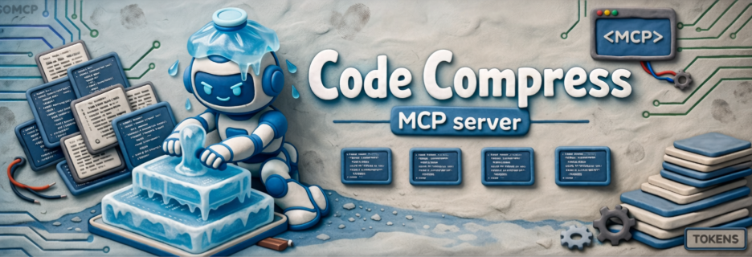

<div align="center">



**Persistent code index for AI agents. Ask for exactly what you need.**

[](https://github.com/MCrank/code-compress/actions/workflows/ci.yml)
[](https://github.com/MCrank/code-compress/actions/workflows/release.yml)
[](https://www.nuget.org/packages/CodeCompress.Server)
[](https://www.nuget.org/packages/CodeCompress.Server)
[](LICENSE)
[](https://dotnet.microsoft.com/download/dotnet/10.0)

</div>

---

## What is CodeCompress?

CodeCompress is an [MCP server](https://modelcontextprotocol.io/) that gives AI coding agents **instant memory of your codebase**.

Instead of scanning every file at the start of each conversation, agents query a persistent SQLite index to get exactly the symbols, types, and dependencies they need — in a fraction of the tokens.

| Without CodeCompress | With CodeCompress |
|---|---|
| Agent reads 50+ files to understand your project | Agent calls `project_outline` — gets the full API surface in ~3–8k tokens |
| 30–150k+ tokens wasted per session on context | 80–90% reduction in context-loading tokens |
| Sub-agents each scan the same files independently | All agents share one persistent index |
| Bigger codebase = longer wait, every time | Index time is constant after first run (incremental) |

## Quick Start

### Prerequisites

- [.NET 10 SDK](https://dotnet.microsoft.com/download/dotnet/10.0) or later

### 1. Add to your AI coding tool

Pick your tool and run one command — that's it.

<details>
<summary><strong>Claude Code</strong></summary>

```bash
claude mcp add --transport stdio codecompress -- dnx CodeCompress.Server --yes
```

</details>

<details>
<summary><strong>VS Code / GitHub Copilot</strong></summary>

Create `.vscode/mcp.json` in your project:

```json
{
  "servers": {
    "codecompress": {
      "type": "stdio",
      "command": "dnx",
      "args": ["CodeCompress.Server", "--yes"]
    }
  }
}
```

</details>

<details>
<summary><strong>Claude Desktop</strong></summary>

Add to `claude_desktop_config.json`:

```json
{
  "mcpServers": {
    "codecompress": {
      "command": "dnx",
      "args": ["CodeCompress.Server", "--yes"]
    }
  }
}
```

</details>

<details>
<summary><strong>Cursor / Windsurf / any MCP client</strong></summary>

CodeCompress uses stdio transport. Point your client at:

```
dnx CodeCompress.Server --yes
```

Or if you prefer a persistent global install:

```bash
dotnet tool install -g CodeCompress.Server
codecompress-server
```

</details>

<details>
<summary><strong>Share with your team (.mcp.json)</strong></summary>

Commit this file at the root of your repo. Claude Code and VS Code pick it up automatically — every team member gets CodeCompress with zero setup:

```json
{
  "mcpServers": {
    "codecompress": {
      "type": "stdio",
      "command": "dnx",
      "args": ["CodeCompress.Server", "--yes"]
    }
  }
}
```

</details>

### 2. Index your project

Your AI agent will call `index_project` automatically when it needs codebase context. You can also trigger it explicitly:

```
index_project(path: "/path/to/your/project")
```

First run does a **full index** — parses every source file and stores symbols in SQLite. Subsequent runs are **incremental** — only files whose SHA-256 hash changed get re-parsed.

### 3. Start coding

That's it. Your agent now has instant access to your codebase structure. It will automatically use tools like `project_outline`, `get_symbol`, and `search_symbols` instead of reading raw files.

## How It Works

```
AI Agent  <── MCP (stdio) ──>  CodeCompress Server
                                      |
                                 Index Engine
                                   /      \
                          Language       SQLite Store
                          Parsers        .code-compress/
                        (Luau, C#)      index.db
```

1. **Index** — CodeCompress walks your source files, hashes each one (SHA-256), and extracts symbols (functions, classes, types, constants) and dependencies (imports/requires) using language-specific parsers.

2. **Store** — Everything goes into a local SQLite database at **`.code-compress/index.db`** in the project directory. The database uses FTS5 virtual tables for fast full-text search.

3. **Query** — Agents call MCP tools to get compressed outlines, look up specific symbols by name, search across the codebase, or check what changed since a snapshot.

4. **Stay current** — Re-indexing is incremental. Only files whose content hash changed are re-parsed. Call `index_project` at the start of any session, or after making changes, and it completes in seconds.

## Keeping the Index Up to Date

CodeCompress is designed to stay current with minimal effort:

| Scenario | What to do |
|---|---|
| **Starting a new agent session** | Call `index_project` — takes seconds if nothing changed |
| **After editing files** | Call `index_project` again — only changed files are re-parsed |
| **Tracking changes across sessions** | Use `snapshot_create` before work, then `changes_since` to see what's different |
| **Force a clean re-index** | Call `invalidate_cache` then `index_project` |

> **Tip for CLAUDE.md / system prompts:** Add an instruction like *"At the start of each session, call `index_project` to refresh the codebase index, then use `project_outline` to understand the project structure."* This ensures your agent always has a fresh index.

## Available MCP Tools

### Indexing

| Tool | What it does |
|------|---|
| `index_project` | Index a project directory (incremental by default) |
| `snapshot_create` | Create a named snapshot for tracking changes over time |
| `invalidate_cache` | Force a full re-index on next `index_project` call |

### Querying

| Tool | What it does |
|------|---|
| `project_outline` | Compressed API surface of the entire project — types, functions, signatures |
| `get_symbol` | Retrieve the full source code of a single symbol by name |
| `get_symbols` | Batch retrieve multiple symbols in one call |
| `get_module_api` | Complete public API of a single file/module |
| `search_symbols` | Full-text search across symbol names, signatures, and docs |
| `search_text` | Raw text search across file contents (with glob filtering) |

### Change Tracking & Navigation

| Tool | What it does |
|------|---|
| `changes_since` | Delta report — what files/symbols changed since a snapshot |
| `file_tree` | Annotated project file tree |
| `dependency_graph` | Import/require dependency graph for a file |

### Server Management

| Tool | What it does |
|------|---|
| `stop_server` | Gracefully shut down the server to release resources and DLL locks |

> **Note:** MCP clients like Claude Code automatically restart the server on the next tool call, so stopping it is always safe.

## Server Lifecycle & Idle Timeout

The CodeCompress server manages its own lifecycle to avoid consuming resources indefinitely.

### Idle Timeout

By default, the server **automatically shuts down after 10 minutes of inactivity** (no MCP tool calls). Every tool call resets the idle timer. The MCP client will restart the server automatically on the next tool call — the restart cost is just process startup (~1–2s), not re-indexing (the SQLite database persists on disk).

| Setting | Value |
|---|---|
| **Default timeout** | 600 seconds (10 minutes) |
| **Disable auto-shutdown** | Set to `0` |

### Configuration

The idle timeout can be configured via **environment variable** or **CLI argument**. If both are set, the CLI argument takes precedence.

**Environment variable** — set `CODECOMPRESS_IDLE_TIMEOUT` (in seconds) in your MCP server config:

```json
{
  "mcpServers": {
    "codecompress": {
      "type": "stdio",
      "command": "dnx",
      "args": ["CodeCompress.Server", "--yes"],
      "env": {
        "CODECOMPRESS_IDLE_TIMEOUT": "120"
      }
    }
  }
}
```

**CLI argument** — pass `--idle-timeout` (in seconds):

```bash
codecompress-server --idle-timeout 120
```

### Stop Server Tool

The `stop_server` tool provides on-demand shutdown — useful for releasing DLL/file locks during development without manually killing processes. The server exits gracefully, closing all SQLite connections, and restarts automatically on the next tool call.

## Supported Languages

| Language | Status | Parser |
|----------|--------|--------|
| Luau (Roblox) | Available | Regex/pattern-based |
| C# / .NET | Available | Regex/pattern-based |
| Python, TypeScript, Go, Rust | Planned | — |

Adding a new language requires implementing a single `ILanguageParser` interface — no changes to storage, indexing, or MCP tools.

## Where is my data stored?

All index data is stored **locally** in the project directory:

```
<project-root>/.code-compress/index.db
```

- One SQLite database per project, stored alongside the code
- Contains: file metadata, parsed symbols, dependencies, FTS5 search indexes, snapshots
- **No data leaves your machine** — no network calls, no telemetry
- Add `.code-compress/` to your `.gitignore` (WAL and SHM files should already be excluded)

To clear the index for a project, delete its `.code-compress/` directory.

## Security

- **Read-only** — never modifies your source files
- **Path traversal prevention** — all file paths canonicalized and validated against the project root
- **SQL injection prevention** — all queries use parameterized statements
- **Prompt injection safeguards** — tool outputs are structured data; raw input is never echoed into freeform text
- **Local only** — no network calls, no telemetry, your code stays on your machine

## Building from Source

```bash
git clone https://github.com/MCrank/code-compress.git
cd code-compress
dotnet build CodeCompress.slnx
dotnet test --solution CodeCompress.slnx
```

To run the MCP server locally:

```bash
dotnet run --project src/CodeCompress.Server
```

To configure a client to use your local build:

```bash
claude mcp add --transport stdio codecompress -- dotnet run --project /absolute/path/to/src/CodeCompress.Server
```

## CLI Tool (Optional)

A standalone CLI is available for testing and debugging outside of MCP:

```bash
dotnet tool install -g CodeCompress
codecompress index /path/to/project
codecompress outline /path/to/project
```

## License

[MIT](LICENSE)
